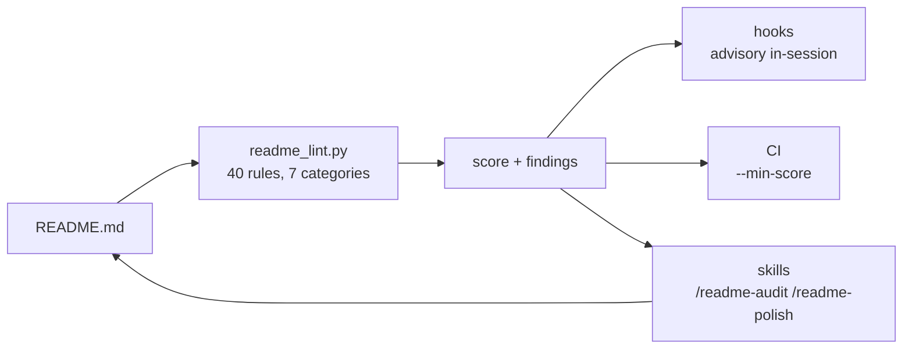

<h1 align="center">awesome-github-readme</h1>

<p align="center">
  <em>A README standard you can actually enforce — a scored rubric, five Claude Code
  skills and advisory hooks, generic to any language or project shape.</em>
</p>

<p align="center">
  <a href="https://github.com/martybytes/awesome-github-readme/actions/workflows/ci.yml"></a>
  <a href="LICENSE"></a>
  <a href="https://github.com/martybytes/awesome-github-readme/tags"></a>
  <a href="https://github.com/martybytes/awesome-github-readme/commits/main"></a>
</p>

<p align="center">
  <a href="#install">Install</a> &middot;
  <a href="#quickstart">Quickstart</a> &middot;
  <a href="docs/SPEC.md">The pattern</a> &middot;
  <a href="docs/rubric.md">Rubric</a> &middot;
  <a href="SECURITY.md">Security</a> &middot;
  <a href="CHANGELOG.md">Changelog</a>
</p>



---

## What it is

Everyone knows a bad README when they see one. Almost nobody can say *why* in a
way another person can act on — so review comments come out as "could you flesh
this out a bit", the author adds three paragraphs of adjectives, and the next
reader still cannot tell what the project does.

This repository turns that judgement into something checkable. The
[pattern](docs/SPEC.md) is written down block by block with the reason for each
one. The [rubric](docs/rubric.md) implements the parts a machine can verify — 40
rules, each with its reasoning one command away. The skills do the parts it
cannot. Nothing here is specific to a language, a framework or a project shape.

- **Scores** any README out of 100 — 7 ms of work, about 70 ms end to end once
  the interpreter has started — with a named fix on every finding. One Python
  file, standard library only, identical on Windows, WSL, Linux and macOS.
- **Explains** itself: `--explain DEP002` gives the paragraph of reasoning behind
  a rule, so a finding is an argument rather than an assertion.
- **Writes** one from scratch by reading the repository first and asking only the
  three questions the code cannot answer.
- **Rewrites** an existing one to the pattern while preserving every concrete
  fact already in it.
- **Builds** the badge row and the Contents list from what the repository can
  actually back, so neither can make a claim the repo cannot support.
- **Warns** in-session when a README is edited, and before a commit — advisory
  by default, blocking only where a repository opts in.

> [!NOTE]
> The rubric is opinionated, and it is derived from one README —
> [terminal-stack](https://github.com/martybytes/terminal-stack), which scores 98
> against it. It rewards a specific style: problem-first prose, rationale
> attached to every feature, and admitted limitations. If your project needs a
> different shape, set a `profile` or `disable` rules in `.awesome-readme.json`
> rather than fighting the score — turning a rule off in the config, where the
> next person can see it, is the difference between a decision and a lapse.
>
> The hooks add context to your Claude Code sessions and touch nothing else.
> `install.py --user` is the only thing here that writes outside its own
> directory: it merges into `~/.claude/settings.json`, backing up first, and
> `--uninstall` removes exactly what it added.

## Contents

<!-- toc -->

- [What it is](#what-it-is)
- [Requirements](#requirements)
- [Install](#install)
- [Quickstart](#quickstart)
- [Configuring](#configuring)
- [What you get](#what-you-get)
- [Continuous integration](#continuous-integration)
- [Security](#security)
- [Troubleshooting](#troubleshooting)
- [How it works](#how-it-works)
- [Development](#development)
- [Layout](#layout)
- [License](#license)

<!-- /toc -->

## Requirements

| You want | You need | Notes |
|---|---|---|
| **The linter alone** | Python 3.9+ | No third-party packages, ever. Copy `scripts/readme_lint.py` anywhere and run it |
| **The skills and hooks** | Claude Code | Installed as a plugin, or copied into `~/.claude` |
| **A demo recording** | [VHS](https://github.com/charmbracelet/vhs) | Optional, and only for the hero GIF |

Git is used for badge detection only — `readme_badges.py` degrades to a
placeholder owner when there is no remote, rather than failing.

## Install

<details open>
<summary><b>As a Claude Code plugin</b> (recommended — updates keep working)</summary>

```sh
git clone https://github.com/martybytes/awesome-github-readme
```

Then in Claude Code:

```text
/plugin marketplace add ./awesome-github-readme
/plugin install awesome-github-readme@martybytes
```

`martybytes` is the marketplace name from `.claude-plugin/marketplace.json`, not
the repository name. The plugin registers its own hooks; nothing goes into `settings.json`.
</details>

<details>
<summary><b>Into <code>~/.claude</code> directly</b> (no plugin system in the loop)</summary>

```sh
python3 scripts/install.py --user
```

Copies the five skills and the reviewer agent, and merges three hook
registrations into `~/.claude/settings.json` after backing it up. Add `--link` to
symlink the skills instead, so a `git pull` updates them.

Undo it with `python3 scripts/install.py --uninstall --user`.
</details>

<details>
<summary><b>Into one repository</b> (the standard travels with the code)</summary>

```sh
python3 scripts/install.py --project ../my-repo --profile library --ci --git-hook
```

Writes `.awesome-readme.json` (the profile and rules that repository has agreed
to), project-local hooks in `.claude/settings.json`, an optional
`.githooks/pre-commit`, and an optional CI job that fetches the linter and
enforces a score floor.
</details>

<details>
<summary><b>Just the linter</b> (no Claude Code at all)</summary>

```sh
curl -fsSLO https://raw.githubusercontent.com/martybytes/awesome-github-readme/main/scripts/readme_lint.py
python3 readme_lint.py README.md
```

One file, no dependencies. This is what the generated CI job does.
</details>

Verify:

```sh
python3 scripts/install.py --status
```

Prints where the plugin is, which skills are installed, which hooks are
registered, and what profile the current repository is set to.

## Quickstart

```sh
python3 scripts/readme_lint.py                    # score ./README.md
python3 scripts/readme_lint.py path/to/README.md  # score any file
python3 scripts/readme_lint.py --json             # one record, for scripts and CI
python3 scripts/readme_lint.py --strict           # exit 1 on any error-level finding
python3 scripts/readme_lint.py --rules            # the whole rubric, as a table
python3 scripts/readme_lint.py --explain DEP002   # one rule, and why it exists
python3 scripts/readme_badges.py                  # a badge row this repo can back
python3 scripts/readme_badges.py --check          # badges it cannot
python3 scripts/readme_toc.py --write             # insert or refresh the Contents list
```

The report is a score, a per-category breakdown, and findings grouped by level —
each with the rule that produced it, the line, and the change that fixes it:

```text
  readme-lint  README.md
  ###########################.  98/100  grade A - profile cli

  hero          34/34   Hero - what a stranger sees in the first screenful
  orientation   31/31   Orientation - what it is, who it is for, what it is not
  onboarding    32/32   Onboarding - the path from zero to a working thing
  mechanics     27/31   Mechanics - links, anchors, alt text, fences

  WARN (1)
    ! MEC004:380  Fenced block with no language.
        -> Tag it: ```sh, ```powershell, ```json, ```text.
```

In Claude Code, the five skills:

```text
/readme-audit     score it, then review the things a linter cannot judge
/readme-init      write one from scratch, reading the repo first
/readme-polish    restructure and sharpen an existing one, keeping every fact
/readme-demo      a VHS tape, a Mermaid diagram, or a theme-aware screenshot block
/readme-badges    build or repair the badge row
```

## Configuring

Everything lives in one optional file at the repository root:

```json
{
  "profile": "library",
  "strict": false,
  "min_score": 80,
  "disable": ["HERO005"],
  "require": ["faq"],
  "allow_badges": [],
  "session_summary": false
}
```

| Key | Does |
|---|---|
| `profile` | which sections this kind of project must have — `cli`, `library`, `service`, `app`, `docs`, `minimal` |
| `strict` | turn the advisory commit check into a blocking gate |
| `min_score` | the floor below which the linter exits non-zero |
| `disable` | rule ids this repository has decided not to satisfy |
| `require` | sections it needs on top of its profile's set |
| `allow_badges` | URL substrings exempt from the vanity-badge rule |
| `session_summary` | report the score once when a Claude Code session starts |

Write it with `install.py --project`, or by hand against
[the schema](schema/awesome-readme.schema.json).

Set `AWESOME_README_HOOKS=0` in the environment to silence every hook without
uninstalling anything.

## What you get

<details open>
<summary><b>The linter</b></summary>

- **40 rules across seven categories**, each carrying a weight, the profiles it
  applies to, and a paragraph of reasoning reachable with `--explain`. A rule
  that cannot justify itself in one paragraph does not belong in a rubric people
  are asked to satisfy.
- **`error`, `warn` and `info` levels.** An `info` finding costs 40% of its
  rule's weight rather than all of it, which is why an honest README lands in the
  nineties rather than at 100 — the last few points are suggestions, and chasing
  them is how a README ends up assembled rather than written.
- **Anchor and relative-link resolution** against the working tree `MEC001`
  `MEC002`. Anchor rot is the defect that renders correctly, looks fine, and
  lands every reader at the top of the page.
- **Disabled rules leave the denominator**, so switching off a rule you fail
  raises the score. That is why `disable` lives in a committed file, where the
  next person can see the decision, rather than in a flag.
- **`--json`** emits one record: score, grade, per-category weights, and every
  finding with its line and its fix.
</details>

<details>
<summary><b>The generators</b></summary>

- **`readme_badges.py`** reads `git remote get-url origin`, the workflow
  directory and every manifest it recognises, then emits only badges this
  repository can actually back — because a CI badge over a repo with no workflow
  is a broken claim on the first screen. `--check` catches the three ways a row
  rots: a deleted workflow, a removed manifest, and a style that drifted when
  somebody pasted a badge from another project.
- **`readme_toc.py`** writes between `<!-- toc -->` markers, so a rebuild is a
  diff of the entries and nothing else. `--check` fails in CI when the list has
  drifted, which is what stops a hand-maintained TOC quietly going stale.
</details>

<details>
<summary><b>The skills and the agent</b></summary>

- **`/readme-audit`** runs the linter, then does the seven things it cannot: read
  the tagline with the title covered, check whose problem the document opens on,
  test whether each claim is falsifiable, judge whether the rationale is real,
  look for admitted limitations, follow the install section literally to find
  where a stranger has to guess, and check the page is still current.
- **`/readme-init`** derives what it can from the repository — the CI workflow is
  the authoritative list of test commands, because it is the only description of
  a project that is executed — and asks only the three questions no repository
  contains: who is this for, what design decision would you defend, and what is
  it deliberately not for.
- **`/readme-polish`** inventories every fact in the original before touching it,
  and walks that inventory afterwards. The parenthetical caveat about a platform
  that half-works is the most valuable sentence in most READMEs and the easiest
  to lose in a rewrite.
- **`readme-reviewer`** is the same prose review as a subagent without the
  Write, Edit or NotebookEdit tools, for a second opinion that reports rather
  than rewrites.
</details>

<details>
<summary><b>The hooks</b></summary>

- **`PostToolUse`** on `Write|Edit|MultiEdit` — a README was edited, so lint it
  and hand the findings back as context. Silent above 95 with no errors, so a
  good README costs nothing.
- **`PreToolUse`** on `Bash` — a `git commit` is about to run. Advisory, unless
  the repository set `"strict": true`, in which case error-level findings return
  a deny with the list attached.
- **`SessionStart`** — off unless `session_summary` is set, because a score you
  did not ask for at the top of every session is noise by the third one.

Advisory is the default everywhere, and that is deliberate: a README linter that
blocks a commit on somebody else's machine is a linter people uninstall.
</details>

<details>
<summary><b>The written pattern</b></summary>

- **[SPEC.md](docs/SPEC.md)** — thirteen blocks in the order a reader meets them,
  each with the question it answers and the rule that checks it.
- **[voice.md](docs/voice.md)** — the prose rules, and the one test: could a
  competitor's README contain this sentence unchanged?
- **[badges.md](docs/badges.md)** — the catalogue, and what is excluded on purpose.
- **[visuals.md](docs/visuals.md)** — VHS, Mermaid, theme-aware screenshots, and
  why the recording has to be reproducible from a committed script.
- **[antipatterns.md](docs/antipatterns.md)** — thirteen common ones, each with the
  reader it costs.
- **[ci.md](docs/ci.md)** — gates, exit codes, the JSON contract, and recipes for
  Actions, GitLab, Azure and `pre-commit`.
- **[SECURITY.md](SECURITY.md)** — the full threat model and the hardening
  checklist.
- **[templates/](templates/)** — six starting READMEs, one per profile, plus a
  commented `demo.tape`.
</details>

## Continuous integration

The linter is one dependency-free file that exits non-zero on demand, so the
YAML is two lines on any platform. The part worth thinking about is the gate.

| Exit | Means |
|---|---|
| `0` | ran, and did not fail a gate — **the default, always, whatever it found** |
| `1` | `--strict` saw an `error` finding, or the score is under `--min-score` |
| `2` | could not run: no such file, or `--explain` named an unknown rule |

Turning on `--strict` in an existing repository fails the first build and
teaches everyone to add `|| true`. Ratchet instead: run it advisory for a
fortnight, then set `min_score` to whatever you score today — so the build fails
only if the README gets *worse* — and raise the floor as it climbs. Most
repositories should stop there. `--strict` is for the ones where a broken README
is a shipped defect.

```yaml
permissions:
  contents: read        # the job needs nothing else
jobs:
  readme:
    runs-on: ubuntu-latest
    timeout-minutes: 5
    steps:
      - uses: actions/checkout@v4
      - uses: actions/setup-python@v5
        with: { python-version: '3.x' }
      - run: python tools/readme_lint.py README.md --no-colour --min-score 80
      - run: python tools/readme_toc.py --check
      - run: python tools/readme_badges.py --check
```

`install.py --project . --ci` writes the lint step of that, with the floor taken
from `min_score` in `.awesome-readme.json` rather than a flag. It fetches the
linter with `curl` for convenience; **vendoring the file into your repo instead
is one commit and removes a supply-chain dependency** — see
[SECURITY.md](SECURITY.md#supply-chain).

`--json` emits one record — score, grade, per-category weights, and every
finding with its line and its fix — which is the interface for a PR comment, a
dashboard, or scoring every README in a monorepo.
[docs/ci.md](docs/ci.md) has GitLab, Azure, `pre-commit`, the JSON schema and a
PR-comment job that keeps the gate on `contents: read`.

## Security

This runs on every file edit and before every commit, and its CI job lints
READMEs written by strangers. So, plainly:

- **No network access, in any script.** Nothing is uploaded, no telemetry, and
  badge URLs are compared against the working tree rather than fetched. Verify
  it yourself: `grep -rE '^\s*(import|from)\s+(urllib|http|socket|requests)' scripts/`
- **The only subprocess is `git`** — `remote get-url origin` and two
  `symbolic-ref` calls in `readme_badges.py`, each passed as an argument list
  with a timeout, never a shell string.
- **It reads four things**: the README, `.awesome-readme.json`, your package
  manifest, and the *filenames* in `.github/workflows/`. Links are checked with
  `exists()` and never opened.
- **Link resolution is confined to the repository**, so a README from a stranger
  cannot make your runner stat arbitrary paths and report which ones exist. That
  is also just correct — GitHub cannot serve `../../elsewhere` either.
- **Input cost is bounded.** Unbounded link regexes let 50k unclosed brackets
  cost 8.7 s; the capped classes make it 0.18 s, and
  `test_pathological_input_stays_fast` keeps it there.
- **Only `install.py` writes outside its own directory**, and only
  `readme_toc.py --write` rewrites the README it was pointed at. The installer
  merges into
  `settings.json` after a dated backup, touching only entries tagged
  `"_source": "awesome-github-readme"`, so your other hooks survive and
  `--uninstall` removes exactly what it added. `--dry-run` shows you first.
- **Every hook exits 0 silently on an unexpected failure**, because a linter that
  breaks your session over its own bug is worse than no linter. Kill them
  outright with `AWESOME_README_HOOKS=0`.

The one place this project can block an action is `PreToolUse` in strict mode,
and only for a repository that asked for it in a file it committed.

Full threat model, the hardening checklist, and how to report something:
[SECURITY.md](SECURITY.md).

## Troubleshooting

| Symptom | Cause |
|---|---|
| Skills do not appear after `--user` | Start a new session; skills load at startup. `install.py --status` shows what is installed |
| `symlink unavailable` on Windows | `--link` needs Developer Mode. It falls back to copying, which works — you just re-run the installer to update |
| The hook says nothing on a good README | Working as intended. `PostToolUse` is silent above 95 with no errors |
| Score dropped after adding a doc link | `MEC001` resolves relative links against the working tree. A link to a file you have not committed yet is a dead link to everyone else |
| `SEC001` demands sections you do not want | Wrong profile. `library`, `service`, `app`, `docs` and `minimal` each require a different set |
| A rule is wrong for your project | Put it in `disable` in `.awesome-readme.json`. In the config, where the next person can see the decision |
| CI fails but local passes | Check `min_score` in `.awesome-readme.json` — CI reads the same file, so the gate is usually a floor you set and forgot |

## How it works

`readme_lint.py` parses the Markdown itself — headings (ATX, setext and raw
HTML), links, images, fences, reference definitions — and keeps a fence map, so
prose-level rules never fire inside a code block. That parser is about 120 lines
and is the reason there is no dependency to install: the alternative is a
Markdown library, and a linter you have to `pip install` before a CI job can use
it is one that does not get used.

Rules are functions with metadata attached — id, category, weight, applicable
profiles, and the reasoning behind them. `--rules` and `--explain` render from
that same metadata, and `docs/rubric.md` is generated from it, so a rule and its
documentation cannot drift apart. Adding a rule means adding one decorated
function.

Everything downstream reads the same `Config`: the hook, the CI job, the skills
and the git hook all resolve `.awesome-readme.json` from the repository root the
same way. A repository's decision about which rules it satisfies is made once and
honoured everywhere, which is the whole reason the config is a file in the repo
rather than a flag someone remembers to pass.

## Development

```sh
python3 -m pytest tests/ -q
python3 scripts/readme_lint.py README.md --strict
python3 scripts/readme_toc.py --check
python3 scripts/readme_badges.py --check
```

Those four are what [CI](.github/workflows/ci.yml) runs, on Ubuntu, macOS and
Windows, against Python 3.9 and 3.13 — the matrix matters here because the
linter's whole claim is that it behaves identically on all of them.

Two of those tests calibrate the rubric rather than the code: a fixture README
written to the pattern must keep scoring 85 or better, and a deliberately bad one
must keep scoring under 45. Every individual rule can pass while the score means
nothing, so without a fixture at each end the rubric drifts into whatever the
last commit felt like.

## Layout

```text
awesome-github-readme/
├── scripts/          the linter, the generators, the hook and the installer
├── skills/           five Claude Code skills, one directory each
├── agents/           the readme-reviewer subagent
├── hooks/            hook registrations for the plugin install
├── docs/             the written pattern, the CI recipes, the generated rubric
├── templates/        six profile READMEs and a commented demo.tape
├── schema/           JSON Schema for .awesome-readme.json
└── tests/            pytest suite, including the calibration fixtures
```

`docs/rubric.md` is generated — `python3 scripts/readme_lint.py --rules` — and
CI fails if it has drifted from the rule definitions. `scripts/` is the only
directory with executable content; everything else is Markdown and JSON, which
is what makes [the security surface](SECURITY.md) small enough to state in full.

## License

[MIT](LICENSE).
