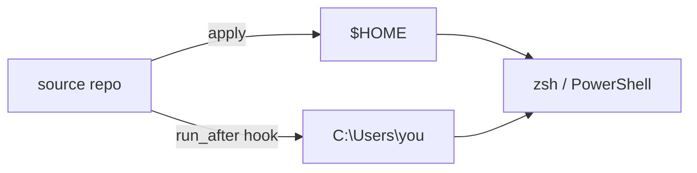

# Visuals

The single highest-leverage element in a README is a picture of the thing
working `HERO005`. It answers "what does this actually do" in the time it takes
to render, and — for a recording — proves the software runs at all, which no
amount of prose does.

The rule that makes it stay true:

> **The visual must be reproducible from a script committed in the repository.**

A hand-recorded GIF is a one-time asset. Six months later the CLI has different
subcommands, nobody can reproduce the recording, and the first thing on the page
is a lie. A committed script means re-recording is one command, which means it
happens.

## Terminal recordings with VHS

[Charm VHS](https://github.com/charmbracelet/vhs) drives a real shell from a
`.tape` script and writes a GIF. [`templates/demo.tape`](../templates/demo.tape)
is a starting point.

```sh
brew install vhs ttyd ffmpeg     # or see the VHS README
vhs docs/demo.tape               # writes docs/demo.gif
```

What separates a good tape from a bad one:

- **Every command is read-only.** `--help`, `--version`, a status or doctor
  command, a listing. A demo that mutates the recording machine is a demo nobody
  re-records, because re-recording it costs them a clean machine.
- **Four commands, not twelve.** The ones a new user meets first, in the order
  they meet them.
- **Record from `$HOME`.** The prompt shows the working directory and the git
  branch; a demo should not ship one contributor's checkout path or an in-flight
  branch name.
- **`Hide` the setup.** Sourcing a profile, `cd`, `clear` — necessary, and not
  part of the story.
- **Pin the font, theme, size and typing speed** in the tape, so two people
  recording it get the same output.
- **Say in the README that it is real.** "The recording at the top is real
  output, not a mock-up" is worth a sentence, and the link to the tape proves it.
- **Say when to re-record.** "Re-record after any change to `--help`" tells the
  next contributor that the asset has a maintenance trigger.

Under about 15 seconds and 2 MB. GitHub will render a larger GIF; a reader on a
phone will not wait for it.

### Alternatives

| Tool | Output | When |
|---|---|---|
| [VHS](https://github.com/charmbracelet/vhs) | GIF, MP4, WebM | Scripted, reproducible, the default here |
| [asciinema](https://asciinema.org/) | `.cast` + a player | Selectable text, tiny files; needs a player or an SVG converter |
| [termtosvg](https://github.com/nbedos/termtosvg) | animated SVG | Crisp at any zoom; no `<video>` and no player |
| [t-rec](https://github.com/sassman/t-rec-rs) | GIF | Records a real window, including a GUI |

## Screenshots

For anything with a GUI. Two rules:

**Ship both themes.** GitHub honours `<picture>` with
`prefers-color-scheme`, so a light-mode reader and a dark-mode reader each get
one that does not glare:

```html
<picture>
  <source media="(prefers-color-scheme: dark)" srcset="docs/app-dark.png">
  <source media="(prefers-color-scheme: light)" srcset="docs/app-light.png">
  
</picture>
```

The `` is the fallback and needs the `alt` `MEC003`; the `<source>`
elements do not take one.

**Crop to the thing.** A full desktop screenshot is 90% chrome. Crop to the
window, and to the region of the window that makes the point.

## Diagrams

For anything whose value is a structure rather than an interaction — a data
flow, a build pipeline, which process owns which file.

GitHub renders Mermaid in a fenced block, which means the diagram is text: it
diffs, it survives a rename, and nobody has to find the `.drawio` source.

````markdown

````

Keep it under about a dozen nodes. Past that a diagram stops being a summary and
becomes a second thing to read; the boundary is roughly the same as the
"architecture in 30 seconds" budget, and for the same reason.

Mermaid inherits the reader's GitHub theme automatically, so it needs no
`<picture>` dance. That alone is often worth choosing it over an exported image.

## Alt text `MEC003`

Alt text is what a screen reader announces and what renders when the asset
404s — which, for a hero GIF, is exactly the moment it matters most.

Describe **what the image shows**, not that it is an image:

| | |
|---|---|
| ✗ | `alt="demo"` |
| ✗ | `alt="screenshot of the app"` |
| ✓ | `alt="tstack listing its subcommands, then tstack doctor reporting every check passing"` |

Badges need it too, and there the alt is the badge's own claim: `alt="CI status"`,
`alt="License: MIT"`. A row of five badges with no alt text is five instances of
"image" in a row for anyone not looking at the screen.

## Where the files live

`docs/` — not the repository root, and not an external host.

An image on a third-party host is a dead image the day that host changes its
terms. An image committed in `docs/` is served by GitHub, works in a fork, works
offline in a clone, and shows up in the diff when it changes.

Reference it relatively (`docs/demo.gif`) `HYG007`, so it resolves on every
fork, branch and mirror.
