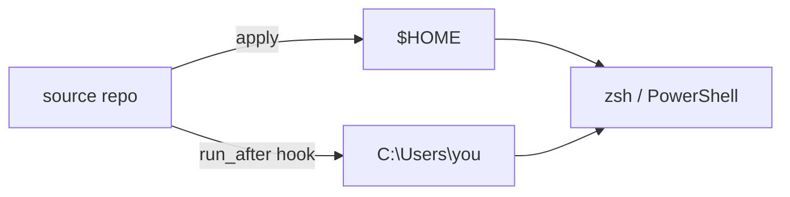

# readme-demo

A README's most valuable element is a picture of the thing working `HERO005`.
The constraint that makes it stay valuable:

> **The visual must be reproducible from a script committed in the repository.**

A hand-recorded GIF is a one-time asset. Six months later the commands have
changed, nobody can reproduce it, and the first thing on the page is a lie that
nothing in CI can detect. A committed script makes re-recording one command,
which is what makes it happen.

## Toolkit

`$TOOLKIT` is `${CLAUDE_PLUGIN_ROOT}/scripts` (plugin install) or the `scripts/`
directory beside this `SKILL.md`. Templates are in `$TOOLKIT/../templates/`.

## Pick the form

| The project is | Use | You can produce it |
|---|---|---|
| a CLI or TUI | a VHS tape → GIF | write the tape now; the maintainer records |
| a library | a Mermaid diagram, or a code block | now, entirely |
| a service | a Mermaid diagram of the request path | now, entirely |
| a GUI app | two screenshots and a `<picture>` block | only the markup; ask for the images |

Prefer the one you can finish. A committed Mermaid diagram beats a promised GIF.

## A terminal recording

Copy `templates/demo.tape` to `docs/demo.tape` and adapt it.

Choosing the commands is the whole job:

- **Four, not twelve.** The ones a new user meets first, in the order they meet
  them: the bare command, `--version`, a health or status check, then the thing
  people actually came for.
- **Every one read-only.** `--help`, `--version`, `doctor`, a listing, a
  `--dry-run`. A demo that mutates the recording machine is one nobody
  re-records, because re-recording costs them a clean machine — and that is how
  a demo goes stale.
- **Verify each command exists.** Read the argument parser or the command table.
  A tape that fails halfway is worse than no tape.

Then the mechanics the template already handles, and why each line is there:

| Line | Why |
|---|---|
| `Hide` … `Show` around the setup | sourcing a profile, `cd ~`, `clear` are necessary and not part of the story |
| `Type "cd ~"` | the prompt shows the working directory and branch; a demo should not ship a contributor's checkout path |
| `Set FontFamily` / `Theme` / `Width` | two people recording it get the same output |
| `Sleep` after each command | the reader needs time to read the output; 2.5–4s per screen |
| `Type "clear" Enter` between commands | each command gets a clean frame |

Keep it under about 15 seconds and 2 MB. Then tell the maintainer:

```sh
brew install vhs ttyd ffmpeg     # or see https://github.com/charmbracelet/vhs
vhs docs/demo.tape               # writes docs/demo.gif
```

Wire it into the README hero:

```html
<p align="center">
  " src="docs/demo.gif" width="760">
</p>
```

And add the section that makes the asset maintainable — this is the part almost
every project omits:

```markdown
## Demo

The recording at the top is real output, not a mock-up.
[`docs/demo.tape`](docs/demo.tape) is the [Charm VHS](https://github.com/charmbracelet/vhs)
script that produced it. Every command in it is read-only. Re-record it after
any change to `--help`.
```

Naming the re-record trigger is what stops the GIF drifting.

## A diagram

Mermaid renders natively on GitHub in a fenced block, which means the diagram is
text: it diffs, it survives a rename, it needs no export step, and it inherits
the reader's theme.

````markdown

````

Draw the thing that is genuinely hard to hold in your head — the ownership
boundary, the request path, the point where two things merge. Do not draw a
folder tree; the layout section already does that better.

Under about a dozen nodes. Past that it stops being a summary and becomes a
second document to read.

## Screenshots

You cannot produce these; ask for them, and be specific about what would show
the point. Meanwhile write the markup:

```html
<p align="center">
  <picture>
    <source media="(prefers-color-scheme: dark)" srcset="docs/screenshot-dark.png">
    <source media="(prefers-color-scheme: light)" srcset="docs/screenshot-light.png">
    " src="docs/screenshot-light.png" width="760">
  </picture>
</p>
```

The `` is the fallback and carries the `alt`; the `<source>` elements do
not take one. Ask for both themes — a light-mode reader given a dark screenshot
gets a glare, and half your readers are one or the other.

## Alt text `MEC003`

Whatever you produce, the alt text describes **what the image shows**, not that
it is an image. It is what a screen reader announces and what renders when the
asset 404s, which for a hero image is exactly when it matters.

| | |
|---|---|
| ✗ | `alt="demo"` |
| ✓ | `alt="tstack listing its subcommands, then tstack doctor reporting every check passing"` |

## Where files go

`docs/`, committed. Not the repository root, and not a third-party host — an
image on someone else's host is a dead image the day their terms change, and it
does not work in a fork or an offline clone. Reference it relatively `HYG007`.

## Check

```sh
python3 $TOOLKIT/readme_lint.py README.md --no-colour
```

`HERO005` passes once a non-badge image or a Mermaid fence is above the first
`##`. `MEC001` will catch a `docs/demo.gif` that does not exist yet — tell the
maintainer that finding is expected until they run the tape.

More detail in [visuals.md](../../docs/visuals.md).
