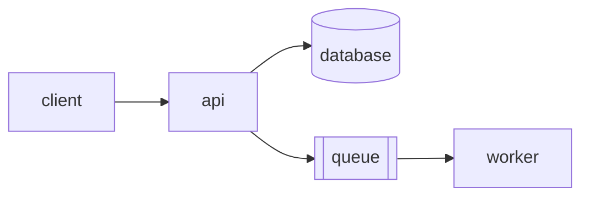

<h1 align="center">{{PROJECT}}</h1>

<p align="center">
  <em>{{TAGLINE — what it serves, to whom, and the operational constraint that
  makes it different.}}</em>
</p>

<p align="center">
  <a href="https://github.com/{{OWNER}}/{{REPO}}/actions/workflows/ci.yml"></a>
  <a href="https://hub.docker.com/r/{{OWNER}}/{{REPO}}"></a>
  <a href="LICENSE"></a>
  <a href="https://github.com/{{OWNER}}/{{REPO}}/releases/latest"></a>
</p>

<p align="center">
  <a href="#requirements">Requirements</a> &middot;
  <a href="#deploy">Deploy</a> &middot;
  <a href="#configuration">Configuration</a> &middot;
  <a href="#architecture">Architecture</a> &middot;
  <a href="docs/runbook.md">Runbook</a>
</p>

<p align="center">
  
</p>

---

## What it is

{{THE OPERATIONAL PROBLEM. What breaks today, at what scale, and what it costs
the team when it does.}}

{{WHAT THIS RUNS INSTEAD, and the one architectural decision behind it.}}

- **Serves** {{what, over what protocol, at what scale}}.
- **Stores** {{what, where, with what durability guarantee}}.
- **Fails** {{how — what happens when a dependency is down}}.
- **Observes** itself through {{metrics endpoint, structured logs, health check}}.

> [!IMPORTANT]
> {{What it needs that is not in this repository — a database, a secret store, a
> network position. What it will do to data it is pointed at. The one
> misconfiguration that loses data.}}

## Contents

<!-- toc -->

- [Requirements](#requirements)
- [Deploy](#deploy)
- [Configuration](#configuration)
- [Operating it](#operating-it)
- [Architecture](#architecture)
- [Development](#development)
- [Layout](#layout)
- [License](#license)

<!-- /toc -->

## Requirements

| Target | You need | Notes |
|---|---|---|
| **Docker Compose** | Docker 24+ | {{single host — the default}} |
| **Kubernetes** | {{version}}, {{ingress}} | {{where the chart lives}} |
| **Bare metal** | {{runtime}}, {{database}} | {{when this is the right choice}} |

Resources: {{CPU}}, {{memory}}, {{disk}} at {{stated load}}.

## Deploy

<details open>
<summary><b>Docker Compose</b></summary>

```sh
curl -fsSLO https://raw.githubusercontent.com/{{OWNER}}/{{REPO}}/main/compose.yaml
{{project}} bootstrap        # seeds .env, generates secrets, creates volumes
docker compose up -d
```
</details>

<details>
<summary><b>Kubernetes</b></summary>

```sh
helm repo add {{project}} https://{{OWNER}}.github.io/{{REPO}}
helm install {{project}} {{project}}/{{project}} -f values.yaml
```
</details>

Verify:

```sh
curl -fsS localhost:{{PORT}}/healthz
```

{{What a healthy response looks like, and what each unhealthy one means.}}

## Configuration

Every setting is an environment variable; none has a value baked into the image.

| Variable | Default | Effect |
|---|---|---|
| `{{VAR}}` | `{{default}}` | {{what it changes}} |
| `{{VAR}}` | *required* | {{what it is, and where to get one}} |

{{Which ports bind where, and whether they bind loopback or every interface.}}

## Operating it

| Task | Command |
|---|---|
| Logs | `{{command}}` |
| Health | `{{command}}` |
| Backup | `{{command}}` |
| Restore | `{{command}}` |
| Upgrade | `{{command}}` |

{{The failure you will actually see first, and what to do about it.}} The full
runbook is in [docs/runbook.md](docs/runbook.md).

## Architecture



{{Two or three paragraphs: the request path, what is stateful, and where the
consistency boundary sits.}}

The long version is in [ARCHITECTURE.md](ARCHITECTURE.md).

## Development

```sh
{{start dependencies}}
{{lint}}
{{test}}
{{integration test}}
```

{{What the integration suite proves end to end, and how long it takes.}}

## Layout

```text
{{project}}/
├── src/       the service
├── deploy/    compose files, chart, manifests
├── docs/      runbook, architecture, decisions
└── tests/     unit and integration suites
```

## License

[MIT](LICENSE).
